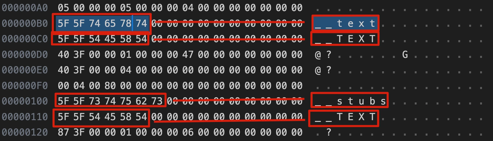
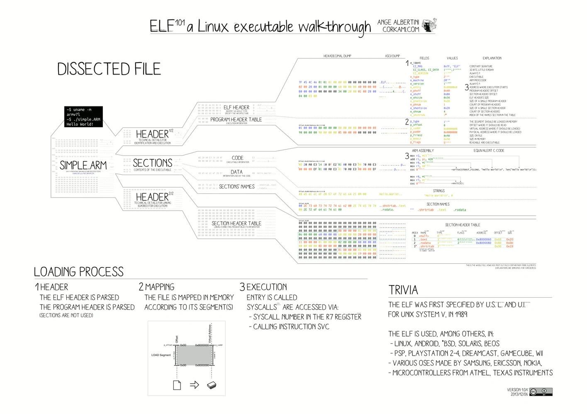

# 定制 javascript runtime - Part 1：前置知识

这一 part 中，我们将会对编译型语言有简单的认识，理解编译、连接过程，以及静态/动态库、以及可执行文件等概念。

对于前端仔来说，对这些内容有一个粗浅的认识是完成后续内容必备的前提。

我的内容以 macOS 为例，其他系统得自行变通一下。建议用 macOS/linux，windows 可以用 WSL。

## 1 source file

```c
// demo.c
#include<stdio.h>
int main() {
	printf("hello\n");
}
```

- 范例：

  - C/C++ `.c` `.cpp`

  - Rust `.rs`

  - Go `.go`

## 2 object file

经过编译步骤，把 source file 编译为 object file，object file 内包含二进制机器码，以及一些元信息：

```bash
gcc -c demo.c
```

`-c` 指定 gcc 只编译，不链接，结果是每个 source file 会产生一个对应的 binary object file。object file 中的内容已经是二进制了，但还不一定能被执行。

部份操作系统中，object file 和 executable file 使用相同的格式，比如 linux 中都是 ELF 格式。而 windows 中，object file 使用 COFF 格式，而 executable file 使用 PE 格式

可以用 objdump 解析生成的 demo.o object file，后面会给例子

- 范例：

  - [ELF](https://en.wikipedia.org/wiki/Executable_and_Linkable_Format)

  - [COFF](https://en.wikipedia.org/wiki/COFF)

  - [Mach-O](https://en.wikipedia.org/wiki/Mach-O)

- 扩展阅读：
  - https://refspecs.linuxbase.org/elf/gabi4+/ch4.intro.html

### 2.1 header file

header file 是 c/c++ 中的概念，比如前面 demo.c 中的 `#include <stdio.h>` 中的 stdio.h 就是一个 header file。

在我们编译 c/c++ 时，如果要用到外部的东西，比如 demo 中要用到 printf，这是 c 标准库中的接口，就需要引入对应的头文件。头文件的作用就是告诉编译器，在我的 demo.c 代码中用到的 printf 函数的定义长什么样子，编译器才能正确生成 object file。

### 2.2 stdio.h 并不神秘

前面说过我们引入 stdio.h header file 只是为了告诉编译器，我们要用到一个叫做 printf 的函数，以及这个函数的定义，让它有足够的信息可以完成编译工作。所以如果我们知道 printf 的定义是什么，完全可以不 include stdio.h：

1 自行编写 header file

```c
// mystdio.h
int printf(const char *format, ...);
```

2 代码中换成 include 我们自己的 header file

```c
// #include <stdio.h>
// #include <...> 是用于引入在系统查找路径中的 header file
// #include "..." 是用于引入本项目内的 header file
// https://gcc.gnu.org/onlinedocs/cpp/Include-Syntax.html
#include "mystdio.h"
```

3 编译、连接、执行

```bash
$ gcc -o demo demo.c
# 生成 demo
$ ./demo
hello
```

### 2.3 object file 和源代码语言无关

有一个有趣的点有些人可能没意识到，前面的 c 语言的 demo 编译出的 object file，其实和 c 已经没有关系了，object file 中 c 代码已经变成了机器码。所以这意味着我们完全可以把不同的语言编译出的 object file 连接到一起。比如 c 和 rust、go 等。比如：

- 在 rust 中调用 c 生成的 object file
  - https://docs.rust-embedded.org/book/interoperability/c-with-rust.html
- 在 c 中调用 rust 编译的 object file
  - https://docs.rust-embedded.org/book/interoperability/rust-with-c.html

当然实际上没有这么简单，不同高级语言编译出的二进制，大概率不能互相理解（扩展阅读“[Application binary interface](https://en.wikipedia.org/wiki/Application_binary_interface)”）。所以实际上如果要实现这种操作，可能还需要一些额外的胶水工作，比如 https://www.swig.org/

## 3 executable file

linker 连接器的功能是连接一组 obejct file 或 archive file，重定位他们的数据，绑定符号引用，生成 executable file。

经过连接步骤，把 object file 连接为 executable file：

```bash
gcc -o demo demo.o
```

或者一条命令完成编译连接过程：

```bash
gcc -o demo demo.c
```

这里演示连接过程中，使用了 gcc 而不直接使用 ld 工具，是因为 gcc 有一些默认配置可以简化我们的工作。比如你可以尝试一下直接使用 ld，大概率会出错：

```bash
$ ld demo.o
ld: Undefined symbols:
  _printf, referenced from:
      _main in demo2.o
```

这是因为 demo.c 中用到了 stdio 的 printf 函数，但 ld 尝试生成 execute file 时没有把 stdio 库和我们的 demo.o object file 连接到一起，导致连接完成后，发现 _printf 这个符号未定义。

增加 `-lstdio` 参数可以要求 ld 把 stdio library 连接进生成的 execute file 中：

```bash
$ ld demo.o -lSystem
ld: library 'System' not found
```

又错了，ld 不知道去哪里找 System library（macOS 中 stdio 是 libSystem 库提供的），所以还得提供查找路径：

```bash
$ ld demo.o -L/Library/Developer/CommandLineTools/SDKs/MacOSX.sdk/usr/lib -lSystem
```

## 4 static library

静态连接库

- 后缀名
  - linux/macos 下
    - `.a` archive
  - windows 下
    - `.lib` library

我们这里针对 archive 说明，如名字所示，一个 `.a` 静态链接库文件，其实就是一组 object file 打包到一起，可以用下面的 demo 体验：

1 编写 library 源码：

```c
// mylib.h
int add(int x, int y);

// mylib.c
int add(int x, int y) {
  return x + y;
}
```

2 构建出 `.a` 静态链接库

```bash
gcc -c mylib.c
# 编译出了一个 object file 叫 mylib.o
ar cr libmylib.a mylib.o
# 使用 ar（archive）工具的 cr（create）子命令
# 创建出一个名为 libmylib.a 的 archive 文件
# 其中包含了 mylib.o 这个 object file
```

3 编写要使用 mylib library 的应用程序

```c
// demo2.c
#include <stdio.h>
#include "mylib.h"

int main() {
  printf("%d\n", add(1,2));
}
```

4 编译、连接

```bash
gcc -c demo2.c
# 生成 demo2.o
```

此时编译出来的 object file 的符号表中，printf 还没有具体定义，还需要下一个连接步骤。以下文 static library 章节中 demo2.o 这个例子，使用 [nm](https://linux.die.net/man/1/nm) 工具我们可以直观看到这一点：

> nm - list symbols from object files 列出 object file 的符号表

```bash
$ nm demo2.o
                 U _add
0000000000000000 T _main
                 U _printf
```

`_add` 和 `_printf` 这两个符号前面的 `U` 就是指它们还没有定义。我们继续完成连接工作：

```bash
gcc -o demo2 demo2.o -L. -lmylib
# -L<xxx> 告诉 linker 可以在哪里查找库文件，因为我们的 libmylib.a 不在标准的查找路径中，所以需要明确指定
# -lmylib 告诉 linker 要把 mylib 这个 library 连接到产物中
```

查看最终连接后的 demo2，结果是：

```bash
$ nm demo2
0000000100000000 T __mh_execute_header
0000000100003f80 T _add
0000000100003f50 T _main
                 U _printf
```

`_add` 符号有定义了，但 `_printf` 还是没有定义，但此时 demo2 是可以正常运行的，因为 `_printf` 是动态链接的。在运行起来之后，libSystem library 会动态链接到我们的 demo2 中。

5 执行连接后生成的 demo2 excutable 文件，运行成功

```bash
$ ./demo2
3
```

## 5 shared library

动态连接库

- 后缀名
  - linux 下
    - `.so` shared object
  - macos 下
    - `.dylib` dynamic library
  - windows 下
    - `.dll` dynamic-link library

和 static library 不同，依赖 shared library 并不会导致 linker 把 library 的内容合并进最终的 excutable file 中，而只会记录一些元信息，供操作系统在运行时动态查找到依赖的 shared library 并和我们的 excutable file 连接起来。

我们这里针对 `.so` 进行说明，与 `.a` 不同，shared object 并不是简单的一组 object file 的集合，它其实是由 linker 连接多个 object 后的产物。我们继续在 static library 章节的基础上，演示 shared library 的使用：

1 library 源码和 demo 源码都一样，不用调整

2 构建出 `.so` shared library

```bash
gcc -shared -o libmylib.so mylib.o
# 从 mylib.o 编译出了一个 shared library 叫 libmylib.so
```

3 编译、连接

```bash
gcc -o demo3 demo2.o -L. -lmylib
# 生成名为 demo3 的可执行文件
# 注意我们除了生成的 executable file 文件名从 demo2 变成 demo3，其他的和 static library 部份完全一样！
```

4 执行连接后生成的 demo3 excutable 文件

```bash
# ./demo3
3
```

其中第三步可能会有疑惑，为什么用完全一样的命令，这次 linker 就使用了 shared library 而不是 static library 呢？

因为 linker 默认行为就是用 shared library，所以如果先找到了 `.so` shared library，就会使用它而不是 `.a` static library。

怎么能确认我们的 demo2、demo3 确实是采用了不同的方式连接的 mylib library 呢？一个办法是对比文件大小，通常来说动态连接的产物要比静态连接的小。但我们的例子中 mylib 实在太小了，所以这样对比不会很明显。所以可以使用一些工具来直观查看 executable file 依赖的库，mac 中可以用 otool：

```bash
$ otool -L demo2
demo2:
        /usr/lib/libSystem.B.dylib (compatibility version 1.0.0, current version 1336.0.0)

$ otool -L demo3
demo3:
        libmylib.so (compatibility version 0.0.0, current version 0.0.0)
        /usr/lib/libSystem.B.dylib (compatibility version 1.0.0, current version 1336.0.0)
```

可以看到 demo2 依赖了 `libSystem.B.dylib`，前面说过这个库是提供 printf 的。这里可以看到它也是动态连接到我们的 demo2 中的。

demo3 则多依赖了一个 libmylib.so 的 shared library，demo2 中没有这一条是因为 libmylib.a 的内容直接被合并进了 demo2 的文件里。

## 6 object file/shared object/excutable file 里有什么

按我自己的经验，如果能在底层理解这些产物，会对主题有更直观深入的理解。不用很深入只要有个直观的印象就好。使用 [objdump](https://man7.org/linux/man-pages/man1/objdump.1.html) 工具我们可以解析这些产物。

首先看一个比较简单的 mylib.o 这个 object file 的内容：

1 编译 mylib.o

```bash
gcc -c -fno-asynchronous-unwind-tables mylib.c
# -fno-asynchronous-unwind-tables 这个参数可以避免 object file 中混进我们不关注的东西，让我们的例子尽可能简单
```

2 使用 objdump 解析 mylib.o

```bash
$ objdump -s -d mylib.o
# -s 显示所有非空 sections
# -d 反汇编文件中的机器码

mylib.o:        file format mach-o 64-bit x86-64
# mach-o 是 macOS 使用的静态链接库文件格式，同时也用在可执行文件、动态连接库等其他场景
# 64-bit x86-64 略
# 这部分内容是从我们的 object file 中的一些元信息中获取的
Contents of section __TEXT,__text:
# 编译后的机器码通常存在 text 段
 0000 554889e5 897dfc89 75f88b45 fc0345f8  UH...}..u..E..E.
 0010 5dc3                                 ].

Disassembly of section __TEXT,__text:
# 前面说编译后的机器码通常存在 text 段，这里是那段机器码的反汇编结果

0000000000000000 <_add>:
# 我们 mylib 里的 add 函数编译后的机器码
#    地址: 机器码                        对应的汇编代码
       0: 55                            pushq   %rbp
       1: 48 89 e5                      movq    %rsp, %rbp
       4: 89 7d fc                      movl    %edi, -4(%rbp)
       7: 89 75 f8                      movl    %esi, -8(%rbp)
       a: 8b 45 fc                      movl    -4(%rbp), %eax
       d: 03 45 f8                      addl    -8(%rbp), %eax
      10: 5d                            popq    %rbp
      11: c3                            retq
```

3 编译 demo2.o

```bash
$ gcc -c -fno-asynchronous-unwind-tables mylib.c
```

4 使用 objdump 解析 demo2.o

```bash
$ objdump -s -d demo2.o

demo2.o:        file format mach-o 64-bit x86-64
Contents of section __TEXT,__text:
 0000 554889e5 bf010000 00be0200 0000e800  UH..............
 0010 00000089 c6488d3d 0b000000 b000e800  .....H.=........
 0020 00000031 c05dc3                      ...1.].
Contents of section __TEXT,__cstring:
# 代码中的文本内容
 0027 25640a00                             %d..
# 25:%
# 64:d
# 0a:\n
# 00:\0  c 语言课上的知识还没忘吧🐶，c语言的字符串以 \0 结尾，读到 \0 就知道字符串结束了

Disassembly of section __TEXT,__text:

0000000000000000 <_main>:
# 我们的 main 函数编译出的机器码
       0: 55                            pushq   %rbp
       1: 48 89 e5                      movq    %rsp, %rbp
       4: bf 01 00 00 00                movl    $1, %edi
       9: be 02 00 00 00                movl    $2, %esi
       e: e8 00 00 00 00                callq   0x13 <_main+0x13>
      13: 89 c6                         movl    %eax, %esi
      15: 48 8d 3d 0b 00 00 00          leaq    11(%rip), %rdi          ## 0x27 <_main+0x27>
      1c: b0 00                         movb    $0, %al
      1e: e8 00 00 00 00                callq   0x23 <_main+0x23>
      23: 31 c0                         xorl    %eax, %eax
      25: 5d                            popq    %rbp
      26: c3                            retq
```

5 最后看看连接后的 demo2 executable file

```bash
$ objdump -s -d demo2   

demo2:  file format mach-o 64-bit x86-64
Contents of section __TEXT,__text:
# add 函数
 100003f40 554889e5 897dfc89 75f88b45 fc0345f8  UH...}..u..E..E.
 100003f50 5dc30000 00000000 00000000 00000000  ]...............
# main 函数
 100003f60 554889e5 bf010000 00be0200 0000e8cd  UH..............
 100003f70 ffffff89 c6488d3d 11000000 b000e804  .....H.=........
 100003f80 00000031 c05dc3                      ...1.].
Contents of section __TEXT,__stubs:
 100003f87 ff257300 0000                        .%s...
Contents of section __TEXT,__cstring:
 100003f8d 25640a00                             %d..
Contents of section __TEXT,__unwind_info:
# 无关，略
 100003f94 01000000 1c000000 00000000 1c000000  ................
 100003fa4 00000000 1c000000 02000000 403f0000  ............@?..
 100003fb4 40000000 40000000 873f0000 00000000  @...@....?......
 100003fc4 40000000 00000000 00000000 00000000  @...............
 100003fd4 03000000 0c000200 14000200 00000000  ................
 100003fe4 20000001 00000000 00000001 00000000   ...............
Contents of section __DATA_CONST,__got:
# 无关，略
 100004000 00000000 00000080                    ........

Disassembly of section __TEXT,__text:

# 记住 add 函数的地址 0x100003f40
0000000100003f40 <_add>:
100003f40: 55                           pushq   %rbp
100003f41: 48 89 e5                     movq    %rsp, %rbp
100003f44: 89 7d fc                     movl    %edi, -4(%rbp)
100003f47: 89 75 f8                     movl    %esi, -8(%rbp)
100003f4a: 8b 45 fc                     movl    -4(%rbp), %eax
100003f4d: 03 45 f8                     addl    -8(%rbp), %eax
100003f50: 5d                           popq    %rbp
100003f51: c3                           retq
                ...
100003f5e: 00 00                        addb    %al, (%rax)

0000000100003f60 <_main>:
100003f60: 55                           pushq   %rbp
100003f61: 48 89 e5                     movq    %rsp, %rbp
100003f64: bf 01 00 00 00               movl    $1, %edi
100003f69: be 02 00 00 00               movl    $2, %esi
# 调用 add 函数，前面说的 add 函数的地址            0x100003f40
100003f6e: e8 cd ff ff ff               callq   0x100003f40 <_add>
100003f73: 89 c6                        movl    %eax, %esi
100003f75: 48 8d 3d 11 00 00 00         leaq    17(%rip), %rdi          ## 0x100003f8d <_printf+0x100003f8d>
100003f7c: b0 00                        movb    $0, %al
# 调用 printf，0x100003f87 这个地址在后面
100003f7e: e8 04 00 00 00               callq   0x100003f87 <_printf+0x100003f87>
100003f83: 31 c0                        xorl    %eax, %eax
100003f85: 5d                           popq    %rbp
100003f86: c3                           retq

Disassembly of section __TEXT,__stubs:

0000000100003f87 <__stubs>:
# 在这里，printf 所在的 libSystem 是动态链接的，情况又不一样
100003f87: ff 25 73 00 00 00            jmpq    *115(%rip)              ## 0x100004000 <_printf+0x100004000>
```

6 既然要理解，不用 objdump 这种工具行不行？

如果你用 hex editor 打开 demo2，能直接看到其中 ascii 码的内容:



objdump 不是什么魔法，它不过是懂得 mach-o 文件格式，按规范去解读而已：

https://github.com/aidansteele/osx-abi-macho-file-format-reference

想了解更多可以参考这个文章：https://yurylapitsky.com/exploring_mach-o_binaries

对于 ELF 格式 wiki 上有一个非常直观的示意图，用 linux 在体验的可以尝试对照着解析一下：



https://en.m.wikipedia.org/wiki/Executable_and_Linkable_Format

## 参考

- https://access.redhat.com/documentation/en-us/red_hat_enterprise_linux/7/html/developer_guide/creating_c_or_c_applications
- https://docs.rust-embedded.org/book/intro/index.html
- https://www.cprogramming.com/tutorial/shared-libraries-linux-gcc.html
- https://en.wikipedia.org/wiki/Shared_library