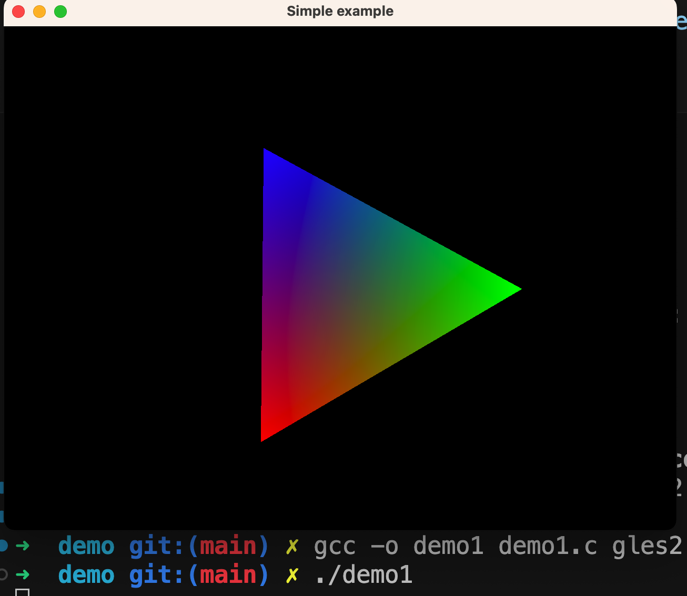

# 定制 javascript runtime - Part 3：shadertoy 1

前面我们在 shell demo 的基础上实现了 `setTimeout`，由于这个项目的玩票性质，接下来我想扩展的不再是 nodejs/deno 中常见的能力。这几章中我将尝试将 glfw 集成进我们的 runtime，让我们的 runtime 支持 opengl 绘制。

说 shadertoy 国内读者可能会不太了解，但说微信小游戏应该都知道。我们这里的目标有些类似，我们是简化到只有 fragment shader，对比微信小游戏也就是少了 canvas api、音频、触摸等系统事件、文件系统、网络、微信开放能力……而已。差不多啦🐶

本章我们主要从 glfw 的[官方 tutorial](https://www.glfw.org/docs/latest/quick.html) 运行一个范例程序，搭建一个简单的类似 [shadertoy](https://www.shadertoy.com/) 的架子。然后 glfw 是针对桌面系统的，而非移动设备。所以不用担心我只是拿小游戏举个例子，我们（目前）不涉及移动开发。

后续我们会将这个自制 shadertoy 集成进我们 part2 中实现的 runtime 中，允许从 javascript 运行部份 shadertoy 的案例。

## 1 体验 glfw

这次我们不再从源码构建 glfw，而是简单点用 homebrew 安装：

```bash
brew install glfw
```

然后可以复制 glfw tutorial 最后的完整代码，也可以直接看 demo 目录中的 demo1.c，有几点需要注意：

- `#INCLUDE <glad/gl.h>` 改成了 `$INCLUDE "glad/gles2.h"`；`gladLoadGL` 改成了 `gladLoadGLES2`
  - 首先这个头文件是去 [glad](https://gen.glad.sh/) 生成的，生成完下载下来，然后目录结构有稍作调整。如果不想折腾直接用 demo 里的。
  - 我们生成时选择的不是 gl 而是 gles2，这是因为我们希望例子和 webgl 更加契合一些，opengl es 2 和 webgl 的渊源可以自行搜索
- tutorial 用到的 `linmath.h` 也已经在 demo 目录中准备好了，项目本身的地址是 https://github.com/datenwolf/linmath.h
  - 如名字所示，是个线性代数的工具库

然后参考 glfw 的[文档](https://www.glfw.org/docs/latest/build_guide.html)构建 demo：

```bash
gcc -o demo1 demo1.c gles2.c -lglfw -framework Cocoa -framework OpenGL -framework IOKit -I./include
```

构建完成后得到可执行文件 `demo1`，运行可以看到一个旋转的彩色三角形，说明 demo 跑通了。



## 2 实现类似 shadertoy 的框架

为避免误会还是提一下，shadertoy 里的案例全是 fragment shader，只用到了 webgl 的一部份能力。属于是带着镣铐跳舞，像是一种限制条件的挑战赛，能用有限的手段实现非常炫酷的效果自然很牛逼，但其实很多案例并不具备实用性。

但这个前提对我们来说就非常合适，因为我们就是希望尽可能简化我们的 runtime 但同时又希望功能完成度不要太低。shadertoy 的限制条件完美符合我们需求🎉。

新建一个 shadertoy 作品，在编辑器上方可以看到我们的 fragment shader 所有可用的输入：


太多了！要是得全搞完，这系列就得弃坑了！所以我们再简化一波，只提供 iTime、iResolution 这两个输入。

### 2.1 简化 glfw 的 demo

我们在 demo1.c 的基础上进行修改，实现一个形如 `void runShadertoy(char* source);` 的函数，简单传入 shadertoy 的着色器代码，就可以打开一个 window 并运行起来。

首先我们复制 demo1.c 为 demo2_1.c，对代码做一些简化。

原本的顶点结构体含有颜色信息，我们这里不需要。然后原本顶点信息里只有一个三角形，要改成两个，正好形成一个正方形：

```c
static const struct
{
    float x, y;
} vertices[6] =
{
    // 左下方三角形
    { -1f, 1f },
    { -1f, -1f },
    { 1f,  -1f },
    // 右上方三角形
    { 1f, -1f },
    { 1f,  1f },
    { -1f, 1f }
    // 共同组成一个正方形
};
```

改动后代码的其他部份也要对应调整，完整改动见 demo2_1.c，在注释里对改动有简单说明。

编译运行，可以得到一个全红的窗口：

```bash
gcc -o demo2_1 demo2_1.c gles2.c -lglfw -framework Cocoa -framework OpenGL -framework IOKit -I./include
```


### 2.2 传入 iTime、iResolution 参数

现在还缺少 iTime、iResolution 两个输入参数，没有时间我们就没法实现动画了。我们在 demo2_1.c 的基础上修改，给 shader 增加这两个参数。具体修改在 demo2_2.c 中有注释说明。

主要改动：

1. 在 fragment shader 中增加了 iTime、iResolution 两个 uniform，用于接收时间和窗口尺寸
2. 渲染循环中给 iTime 传入 `glfwGetTime()` 获取到的时间。
  - 它是从 glfw 初始化以来流逝的秒数
3. 给 iResolution 传入窗口尺寸
3. 另外我们删掉了 `linmath.h`，其实从 demo2_1.c 开始就已经不需要它了，因为我们删掉了 MVP 变换相关的逻辑。

编译运行（编译命令省略），得到一个动画：


### 2.3 验证是否能正常运行 shadertoy 上的作品

理论上我们现在已经可以运行任何只用到了 iTime 和 iResolution 两个输入的 shadertoy 例子了，我们找一个酷炫一点的来试试看。

https://www.shadertoy.com/view/mtyGWy

这个看起来就很炫的样子，替换一下看看：


看起来没什么问题～但如果你真的手动替换了的话，手应该已经很累了吧？

把 shader 写死在代码改起来很不方便，下一步我们改为从文件读取 shadertoy 的代码。

### 2.4 从文件读取 shadertoy 代码

